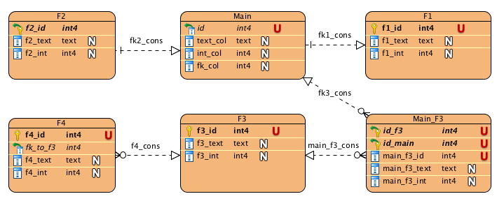

# Pseudo-Column Display

By using `display` attribute in the [source-syntax](pseudo-columns.md), you can customize the presented value to the users. The following is the accepted syntax:

```
{
    "source": <any acceptable source>,
    "display": {
        "markdown_pattern": <markdown pattern value>,
        "template_engine": <"handlebars" | "mustache">,
        "wait_for": <wait for list>
    }
}
```

## Accessing Pseudo-Column Values Using By Utilizing Source Definitions

In the `markdown_pattern`  you have access to the columns, fkeys, and sources that are defined on the source definitions annotation. For more information please refer to [this document](pseudo-column-template.md)

## Accessing Current Pseudo-Column Data

Apart from accessing the source definitions, you can access the current pseudo-column data with `$self` namespace. The structure of the available data is going to be different based on pseudo-column type. In the following, we summarized the structure of object that you have access to. If you want to just look at some examples, go to the [examples](#examples) section. The examples follow the rules defined for handlebars templates, mostly the [Each Helper](handlebars.md#each-helper).

### $self Data Structure

1. **Inline table in record page**: When entity-mode source without any aggregate functions is defined on the `visible-foreign-keys` or in `visible-columns` for `detailed` context.

    ```javascript
    {
      "$self": [
        {
          "values": {
            "col": "", // formatted
            "_col": "", // raw
            ... // other columns
            "$fkey_schema_fk1": {
              "values": {
                "fk_col": "", // formatted
                "_fk_col": "", // raw
                ...
              },
              "rowName": "",
              "uri": {"detailed": ""}
            },
            ... // other outbound foreign keys
          },
          "rowName": "",
          "uri": {
              "detailed": "" // link to record page
          }
        },
        ... // other rows
      ]
    }
    ```
    Example: `{{#each $self}}[{{{this.rowName}}}]({{{this.uri.detailed}}}){{/each}}`


2. **Entity `array` or `array_d` aggregate**

    ```javascript
    {
      "$self": [
        {
          "values": {
            "col": "", // formatted
            "_col": "", // raw
            ... // other columns
          },
          "rowName": "",
          "uri": {
            "detailed": "" // link to record page
          }
        },
        ... // other rows
      ]
    }
    ```
    Example: `{{#each $self}}[{{{this.rowName}}}]({{{this.uri.detailed}}}){{/each}}`


3. **All-outbound entity**:

    ```javascript
    {
      "$self": {
        "values": {
          "col": "", // formatted
          "_col": "", // raw
          ... // other columns
        },
        "rowName": "",
        "uri": {
          "detailed": "" // link to record page
        }
      }
    }
    ```
    Example: `[{{{$self.rowName}}}]({{{$self.uri.detailed}}})`


4. **Scalar `array` or `array_d` aggregate**:

    ```javascript
    {
      "$self":  "1,234, 1,235", // formatted
      "$_self":  [1234, 1235] // raw
    }
    ```
    Example: `values: {{{$self}}}`

5. **`min`/`max`/`cnt_d`/`cnt` aggregate or any scalar column**:

    ```javascript
    {
      "$self":  "1,234", // formatted
      "$_self":  1234 // raw
    }
    ```
    Example: `{{{$self}}} cm`

6. **self-link**:

    ```javascript
    {
      "$self": {
        "values": {
          "col": "", // formatted
          "_col": "", // raw
          ... // other columns
        },
        "rowName": "",
        "uri": {
          "detailed": "" // link to record page
        }
      }
    }
    ```

### Examples

Assume the following is the ERD and we're writing these annotations for the table `main`.



> CAUTION The newlines and extra space has been added for readability. You should remove them if you want to use the exact same value


1. **Inline table in record page**:

    ```javascript
    "annotations": {
        "tag:isrd.isi.edu,2016:visible-columns": { // visible column
            "detailed": [
                {
                    "source": [{"inbound": ["s", "fk2_cons"]}, "f2_id"],
                    "entity": true,
                    "display": {
                        "markdown_pattern": "<markdown goes here>",
                        "template_engine": "handlebars"
                    }
                }
            ]
        },
            "tag:isrd.isi.edu,2016:visible-foreign-keys": { // related entities section
            "detailed": [
                {
                    "source": [
                        {"inbound": ["s", "fk3_cons"]},
                        {"outbound": ["s", "main_f3_cons"]},
                        "f3_id"
                    ],
                    "entity": true,
                    "display": {
                        "markdown_pattern": "<markdown goes here>",
                        "template_engine": "handlebars"
                    }
                }
            ]
        }
    }
    ```

    Examples:
      - A list of comma-seperated clickable row-names.
        ```
        {{#each $self}}
          [{{{this.rowName}}}]({{{this.uri.detailed}}})
          {{#unless @last}}, {{/unless}}
        {{/each}}
        ```
      - Condition based on other outbound foreignkeys (example based on f3).
        ```
        {{#if ($self.$fkey_s_f4_cons.values.f4_id 13)}}
            {{#each $self}}
              [{{{this.rowName}}}]({{{this.uri.detailed}}})
              {{#unless @last}}, {{/unless}}
            {{/each}}
        {{/if}}
        ```

2. **Entity `array` or `array_d` aggregate**

    ```javascript
    "annotations": {
        "tag:isrd.isi.edu,2016:visible-columns": { // visible column
            "detailed": [
                {
                    "source": [{"inbound": ["s", "fk2_cons"]}, "f2_id"],
                    "entity": true,
                    "aggregate": "array_d",
                    "display": {
                        "markdown_pattern": "<markdown goes here>",
                        "template_engine": "handlebars"
                    }
                }
            ]
        }
    }
    ```

    Examples:

    - A list of comma-seperated clickable row-names.
      ```
      {{#each $self}}
        [{{{this.rowName}}}]({{{this.uri.detailed}}})
        {{#unless @last}}, {{/unless}}
      {{/each}}
      ```

3. **All-outbound entity**:

    ```javascript
    "annotations": {
        "tag:isrd.isi.edu,2016:visible-columns": { // visible column
            "detailed": [
                {
                    "source": [{"outbound": ["s", "f1_cons"]}, "f1_id"],
                    "entity": true,
                    "display": {
                        "markdown_pattern": "<markdown goes here>",
                        "template_engine": "handlebars"
                    }
                }
            ]
        }
    }
    ```

    Examples:

    - clickable row-name.
    ```
    [{{{$self.rowName}}}]({{{$self.uri.detailed}}})
    ```

    - Access values of the referred table.
    ```
    {{{$self.values._f1_int}}} - {{{$self.values.f1_text}}}
    ```

4. **Scalar `array` or `array_d` aggregate**:

    ```javascript
    "annotations": {
        "tag:isrd.isi.edu,2016:visible-columns": { // visible column
            "detailed": [
                {
                    "source": [{"inbound": ["s", "fk2_cons"]}, "f2_int"],
                    "entity": true,
                    "aggregate": "array_d",
                    "display": {
                        "markdown_pattern": "<markdown goes here>",
                        "template_engine": "handlebars"
                    }
                }
            ]
        }
    }
    ```

    Examples:

    - Show formatted value with condition:
    ```
    {{#if $_self.length}}
    No matching value.
    {{else}}
    values are: {{{$self}}}
    {{/if}}
    ```


5. **`min`/`max`/`cnt_d`/`cnt` aggregate or any scalar column**:

    ```javascript
    "annotations": {
        "tag:isrd.isi.edu,2016:visible-columns": { // visible column
            "detailed": [
                {
                    "source": [{"inbound": ["s", "f2_cons"]}, "f2_id"],
                    "aggregate": "<aggregate function>",
                    "display": {
                        "markdown_pattern": "<markdown goes here>",
                        "template_engine": "handlebars"
                    }
                },
                {
                    "source": [{"outbound": ["s", "f1_cons"]}, "f1_int"],
                    "entity": false,
                    "display": {
                        "markdown_pattern": "<markdown goes here>",
                        "template_engine": "handlebars"
                    }
                },
                {
                    "source": "int_col",
                    "display": {
                        "markdown_pattern": "<markdown goes here>",
                        "template_engine": "handlebars"
                    }
                }
            ]
        }
    }
    ```

    Examples:

    - Check whether at least one value exists in a path (based on first defined column with `"aggregate": "cnt"`).

    ```
    {{#if (eq $_self 0)}}
        No matching row found.
    {{else}}
        Found at least one matching row.
    {{/if}}
    ```

    - Add extra constant values to the database value.
    ```
    {{{$_self}}} miles
    ```

6. **self-link**:

    ```javascript
    "annotations": {
        "tag:isrd.isi.edu,2016:visible-columns": { // visible column
            "detailed": [
                {
                    "source": "id",
                    "entity": true,
                    "self_link": true,
                    "display": {
                        "markdown_pattern": "<markdown goes here>",
                        "template_engine": "handlebars"
                    }
                }
            ]
        }
    }
    ```

    - The default display:
    ```
    [{{{$self.rowName}}}]({{{$self.uri.detailed}}})
    ```
